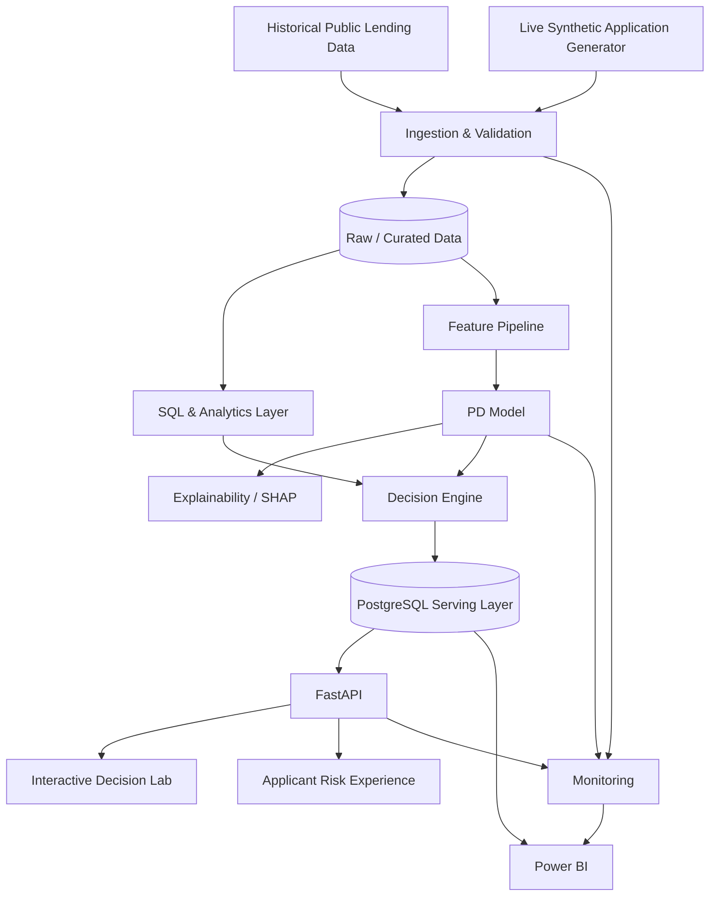

# NorthPole CreditLens — Architecture

## Target Architecture

## Development Principle
The platform follows **Describe → Diagnose → Predict → Prescribe → Monitor** so analytics, data science, decision science, and BI are parts of one production workflow rather than separate portfolio exercises.

## Planned Technology Stack
- Python
- SQL / PostgreSQL
- pandas / Polars
- scikit-learn + XGBoost/LightGBM
- SHAP
- FastAPI + Pydantic
- Power BI
- Streamlit or a lightweight web decision experience
- Docker
- GitHub Actions
- AWS S3, RDS, EventBridge/Lambda, ECR and an appropriate container runtime
- CloudWatch

## Environments
1. Local development
2. CI/test
3. Cloud demo/production-like environment

Cloud services will be introduced only after the local analytical and serving paths are stable.
